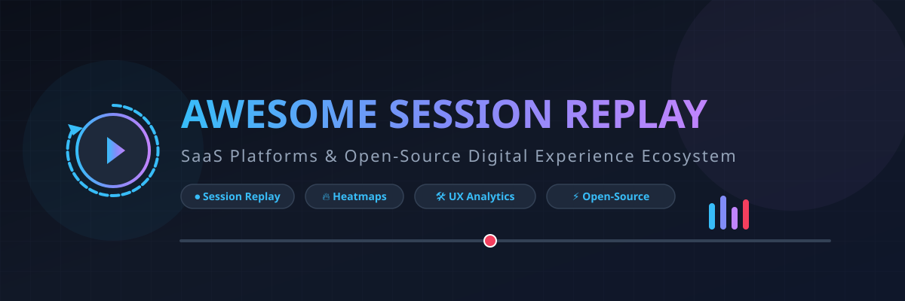

  

  
  
  
  
  
  

# 🎥 Awesome Session Replay Platform & Digital Experience Ecosystem 🚀

**Curated List of SaaS Products & Open-Source GitHub Projects for Session Recording, User Behavior Replay, Heatmaps, Frontend Debugging & Digital Experience Analytics (DXA)**  
*Last updated: September 2026*

---

## 📌 Table of Contents
- [🔍 Overview & SEO Keywords](#-overview--seo-keywords)
- [🏢 SaaS / Hosted Platforms](#-saas--hosted-platforms)
- [⚡ Open-Source GitHub Projects](#-open-source-github-projects)
- [📈 Star History](#-star-history)
- [🤝 How to Contribute](#-how-to-contribute)
- [⚖️ Disclaimer](#-disclaimer)

---

## 🔍 Overview & SEO Keywords

This repository tracks notable **SaaS platforms** and **open-source projects** for **Session Replay**, **User Behavior Analytics**, and **Digital Experience Intelligence (DXI)**. These tools capture and replay user interactions on websites and mobile applications so engineering, product, and UX teams can understand real user behavior, reproduce elusive frontend bugs, analyze conversion funnels, and optimize UX journeys.

**Key SEO Keywords & Topics:** `Session Replay`, `User Session Recording`, `Heatmaps`, `Digital Experience Analytics (DXA)`, `Frontend Debugging`, `Rage Click Detection`, `Customer Journey Analytics`, `Product Analytics`, `rrweb`, `Self-Hosted Session Recording`, `GDPR Compliant UX Tools`.

---

## 🏢 SaaS / Hosted Platforms

📊 **Market Insights**: The global Session Replay & Digital Experience Analytics (DXA) market size is estimated at **~$3.2 Billion USD**, projected to reach **$6.5+ Billion USD by 2030** (CAGR ~16.5%). The sector is **moderately fragmented**, led by a few major enterprise category leaders (Contentsquare, FullStory, Quantum Metric) while remaining highly competitive alongside specialized mid-market platforms and rapidly growing open-source alternatives.

*Note: The table below is sorted in **descending order by Company Size / Valuation / Revenue**.*

| Product 🌐 | Description 📝 | Company Size / Valuation / Revenue 💰 | Starting Pricing 💵 | Free Tier / Trial Limit 🎁 |
| :--- | :--- | :--- | :--- | :--- |
| **[Microsoft Clarity](https://clarity.microsoft.com/)** | Free session replay and heatmap product from Microsoft with unlimited recordings, rage-click detection, and simple setup. | Parent: Microsoft ($3.1 Trillion Valuation / $245B+ Revenue) | $0/mo (100% free) | Unlimited sessions & recordings (30-day data retention) |
| **[Smartlook](https://www.smartlook.com/)** | Qual-quant analytics tool providing session recording, automatic event tracking, and funnel analysis. | Parent: Cisco Systems ($200B+ Valuation / Acquired 2023) | Starts at $55/mo (Pro plan) | Free plan includes 3,000 sessions/month; 30-day free trial |
| **[Contentsquare](https://contentsquare.com/)** | Digital experience analytics platform providing session replay, customer journey mapping, and merchandising analysis. | $5.6 Billion Valuation (~$350M ARR) | Starts at $39/mo (Growth plan) | Free plan includes 200,000 monthly sessions (10,000 replays); 15-day free trial |
| **[FullStory](https://www.fullstory.com/)** | Enterprise digital experience platform offering high-fidelity session replay, autocapture, search, and behavioral analytics. | $1.8 Billion Valuation (~$100M ARR) | $0/mo (Free plan) / Paid starts at ~$250/mo (~$10,000/yr) | Free plan includes 30,000 sessions/month (10 seats); 14-day free trial (up to 5,000 sessions) |
| **[Quantum Metric](https://www.quantummetric.com/)** | Real-time digital experience platform focusing on session replay, customer journey analytics, and business impact. | $1.0 Billion Valuation (~$50M ARR) | Paid contracts start at ~$2,083/mo (~$25,000/yr) | Guided demo & proof-of-concept (POC) trial upon request |
| **[Hotjar](https://www.hotjar.com/)** | Behavior analytics platform combining session recordings, heatmaps, surveys, and feedback tools. | Acquired for ~$500M+ (Subsidiary of Contentsquare) | Starts at $39/mo (Growth plan) | Free plan includes up to 200,000 monthly sessions; 15-day free trial |
| **[LogRocket](https://logrocket.com/)** | Session replay and frontend monitoring tool capturing console logs, network requests, errors, and state alongside replays. | ~$200 Million Valuation (~$30M ARR) | Starts at $69/mo (billed annually) / $99/mo | Free plan includes 1,000 sessions/month (3 seats); 14-day free trial |
| **[Glassbox](https://www.glassbox.com/)** | Enterprise digital experience analytics platform with session replay, journey analysis, and CX intelligence. | ~$150 Million Acquisition Valuation (~$57.3M ARR) | Paid contracts start at ~$833/mo (~$10,000/yr) | 14-day free trial / Demo POC available upon request |
| **[UXCam](https://uxcam.com/)** | Mobile-focused session replay and analytics platform for iOS and Android native apps. | ~$50M - $100M Valuation (~$15M ARR) | Starts at $99/mo (Starter plan) | Free plan includes 3,000 sessions/month; 14-day free trial (up to 100,000 sessions) |
| **[Mouseflow](https://mouseflow.com/)** | Session replay and heatmap platform offering form analytics, funnels, and qualitative user insights. | ~$50 Million Valuation (~$15M ARR) | Starts at $25/mo (Essential plan) | Free plan includes 500 sessions/month (1 website); 14-day free trial |
| **[Lucky Orange](https://www.luckyorange.com/)** | Conversion optimization tool featuring session recordings, heatmaps, dynamic funnels, and live chat. | ~$30M - $50M Valuation (~$10M ARR) | Starts at $19/mo (Build plan) | Free plan includes 100 sessions/month; 7-day free trial |
| **[Inspectlet](https://www.inspectlet.com/)** | User testing and session recording platform with eye-tracking heatmaps and A/B testing support. | ~$20 Million Valuation (~$5M ARR) | Starts at $39/mo (Micro plan) | Free plan includes 2,500 recorded sessions/month (up to 3 websites) |

---

## ⚡ Open-Source GitHub Projects

Session replay has vibrant open-source alternatives giving teams full data privacy, compliance, and self-hosting flexibility.

*Note: The table below is sorted in **descending order by GitHub Star Count**.*

| Repository 🐙 | GitHub_Stars ⭐ | Description 📝 | Replay Engine / Tech Stack ⚡ |
| :--- | :--- | :--- | :--- |
| 🛠️ **[Sentry](https://github.com/getsentry/sentry)** |  | Application monitoring & error tracking platform with built-in open-source session replay tightly linked to stack traces. | Custom / rrweb-based |
| 🦔 **[PostHog](https://github.com/PostHog/posthog)** |  | All-in-one open-source product analytics platform featuring session replay, heatmaps, funnels, and feature flags. | rrweb engine |
| 📊 **[Umami](https://github.com/umami-software/umami)** |  | Fast, privacy-focused open-source web analytics solution with telemetry and user session tracking. | Custom JS capture |
| 📈 **[Plausible Analytics](https://github.com/plausible/analytics)** |  | Lightweight and open-source web analytics platform with privacy-first user journey tracking. | Lightweight telemetry |
| 🌐 **[Matomo](https://github.com/matomo-org/matomo)** |  | Leading ethical open-source web analytics suite with Heatmaps, Session Recording plugin, and full data ownership. | Matomo Replay plugin |
| 🎬 **[rrweb](https://github.com/rrweb-io/rrweb)** |  | Foundational MIT-licensed web session recorder and player library powering most commercial and open-source replay tools. | DOM Mutation Observer |
| 🔄 **[OpenReplay](https://github.com/openreplay/openreplay)** |  | Top dedicated self-hosted session replay & product analytics suite for debugging web apps with full data privacy. | Native OpenReplay engine |
| 🔍 **[HyperDX](https://github.com/hyperdxio/hyperdx)** |  | Open-source developer observability platform unifying session replay, log management, and trace correlation. | OpenTelemetry + rrweb |
| 💡 **[Highlight](https://github.com/highlight/highlight)** |  | Open-source full-stack observability platform combining session replay with front-end error tracking and performance. | rrweb + ClickHouse |
| 🚀 **[Openpanel](https://github.com/openpanel-dev/openpanel)** |  | Modern open-source product analytics and session recording platform designed for web and mobile apps. | Custom event engine |

---

## 📈 Star History

---

## 🤝 How to Contribute

1. Fork this repository 🍴
2. Add or update entries in `README.md` following the tabular format.
3. Submit a Pull Request (PR) with factual descriptions and links to official sites.
4. Check out [Awesome-Awesome-Awesome](https://github.com/ishandutta2007/Awesome-Awesome-Awesome) for more curated lists! ⭐

---

## ⚖️ Disclaimer

- This list is **community-curated** for educational and research purposes.
- Session replay software collects sensitive user interaction data. Ensure proper consent, mask PII, and maintain strict compliance with GDPR, CCPA, and data privacy laws.
